# Performance

## Initial Profiling

### 1. Sorting Countries

**Sorting by name ascending:**
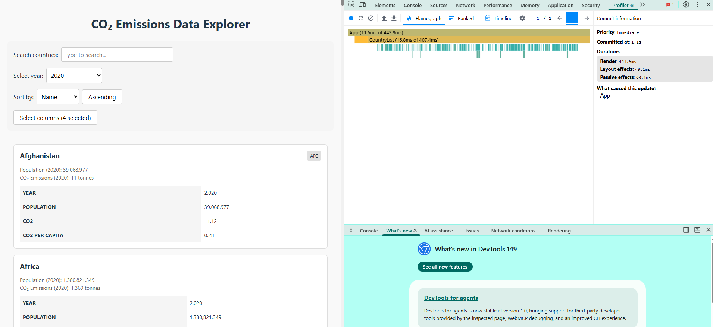

- Commit duration: 1.1 ms
- Render duration: 443.9 ms
- Flame chart:
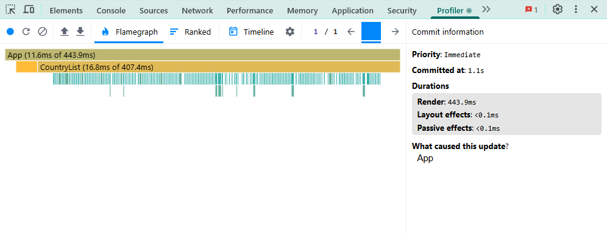

**Sorting by name descending:**

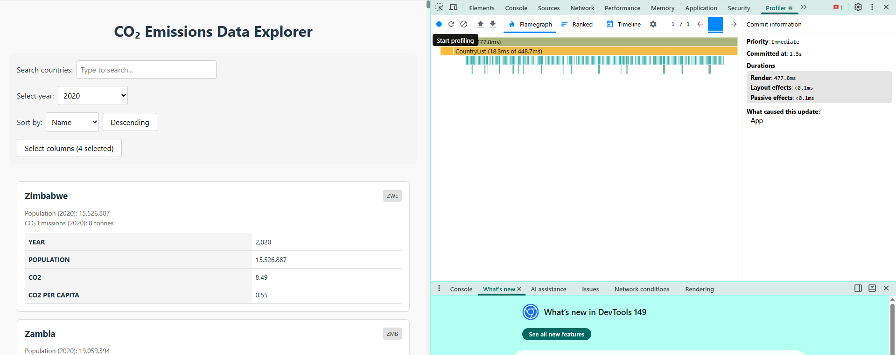

- Commit duration: 1.5 ms
- Render duration: 477.8 ms
- Flame chart:
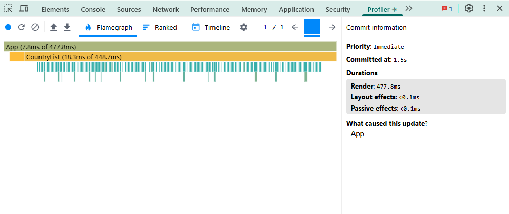

**Sorting by population ascending:**
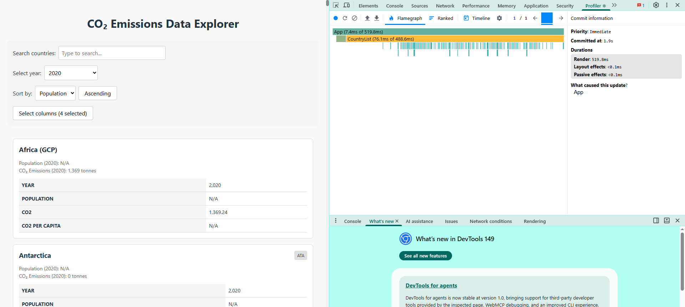

- Commit duration: 1.9 ms
- Render duration: 519.8 ms
- Flame chart:
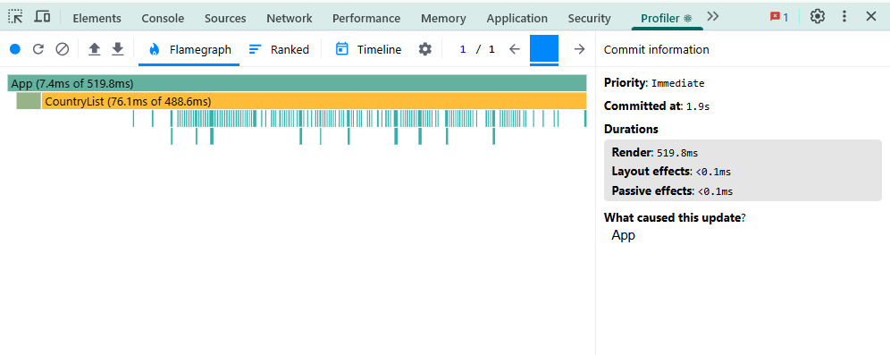

**Sorting by population descending:**
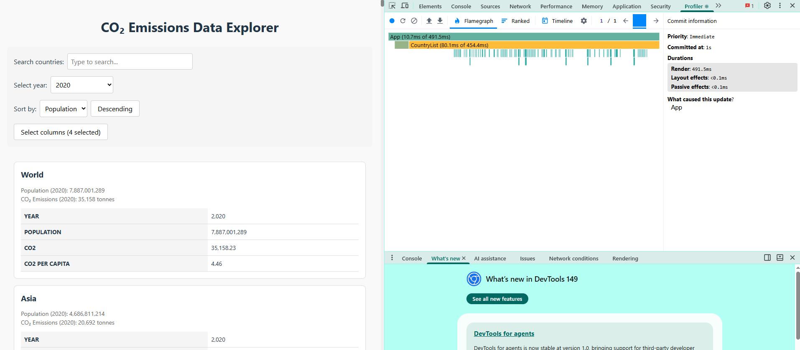

- Commit duration: 1 ms
- Render duration: 491.5 ms
- Flame chart:
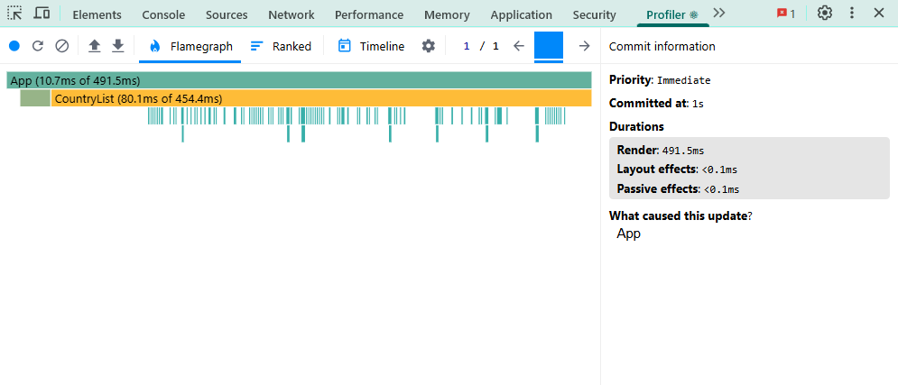

### 2. Searching for a country
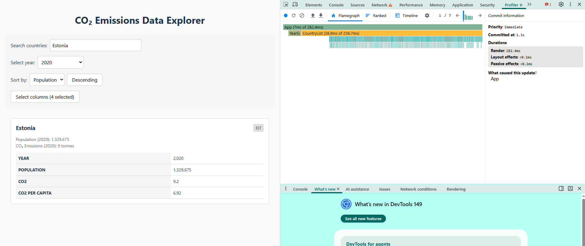
- Commit duration: 1.3 ms
- Render duration: 282.4 ms
- Flame chart:
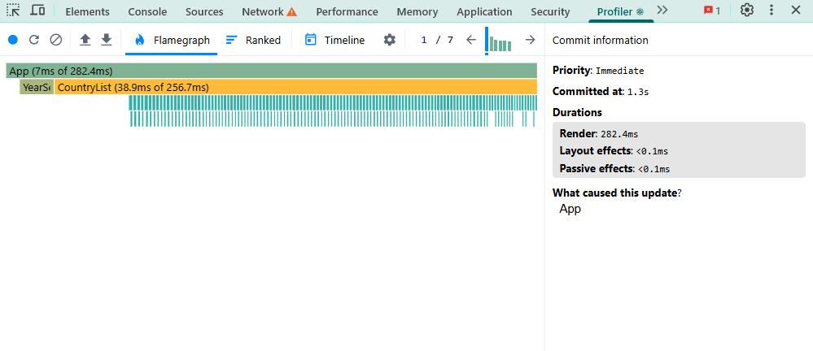

### 3. Selecting a different year
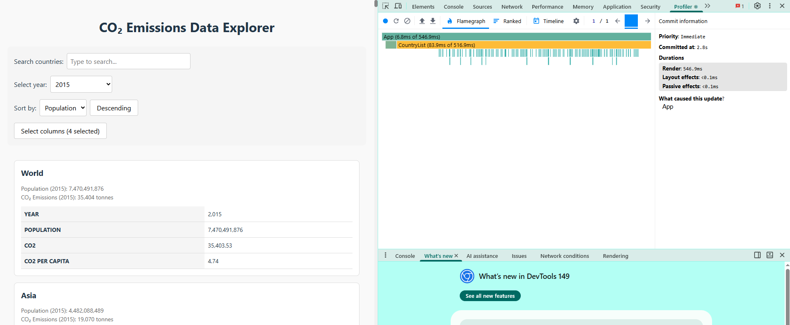
- Commit duration: 2.8 ms
- Render duration: 546.9 ms
- Flame chart:
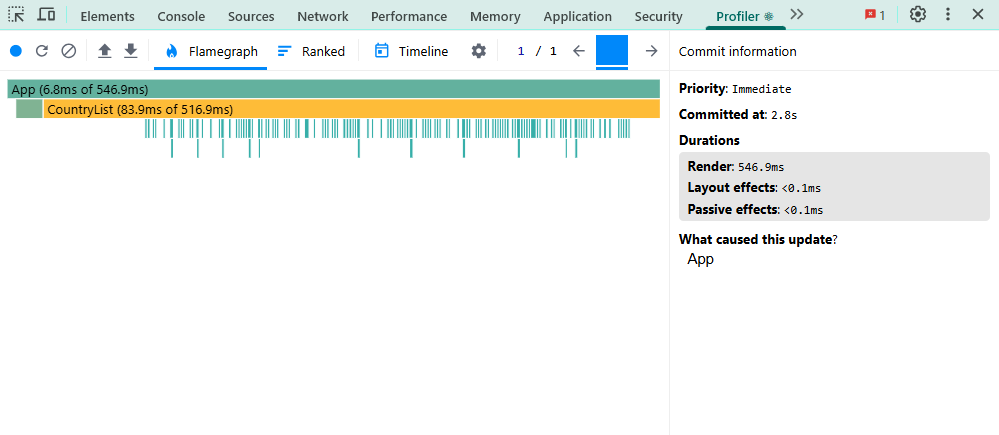

### 4. Toggling columns
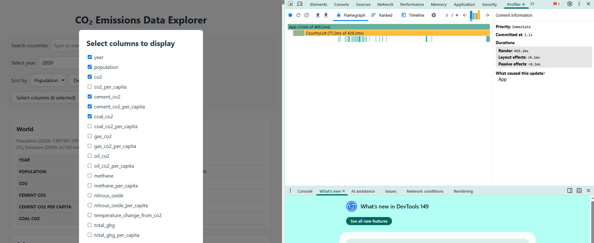

- Commit duration: 1.1 ms
- Render duration: 469.2 ms
- Flame chart:
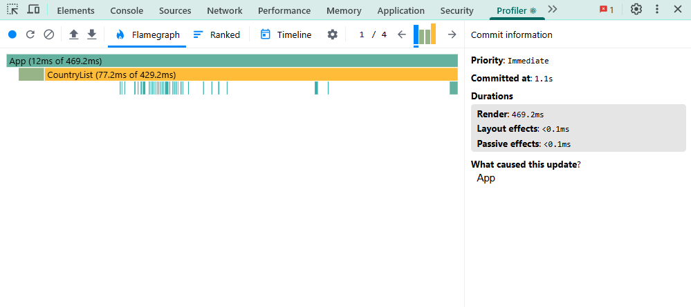