# Performance Optimization Report

## Baseline Measurements

### Interaction A: Sort countries

- **Commit duration**: 549.4 ms
- **Render duration**: 549.3 ms
- **Screenshot**: 

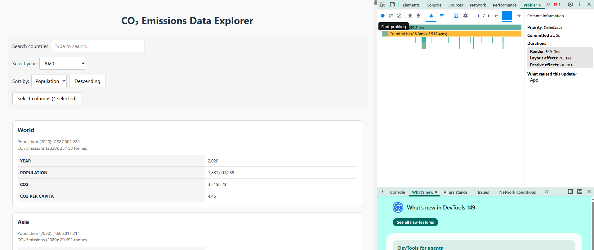
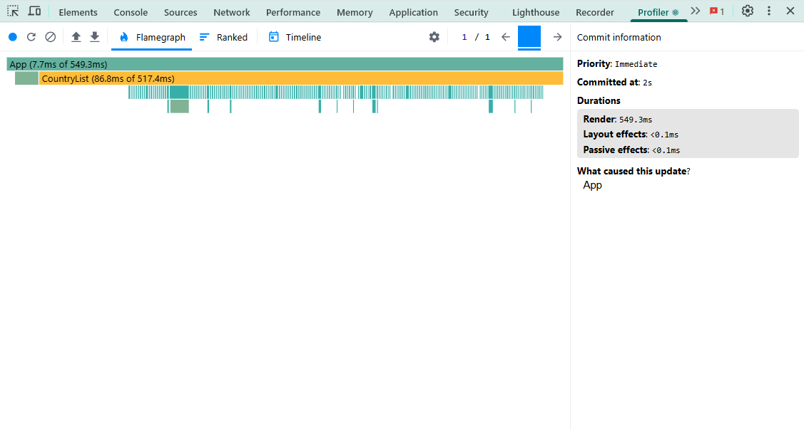

---

### Interaction B: Search countries

- **Commit duration**: 204.9 ms
- **Render duration**: 204.8 ms
- **Screenshot**: 
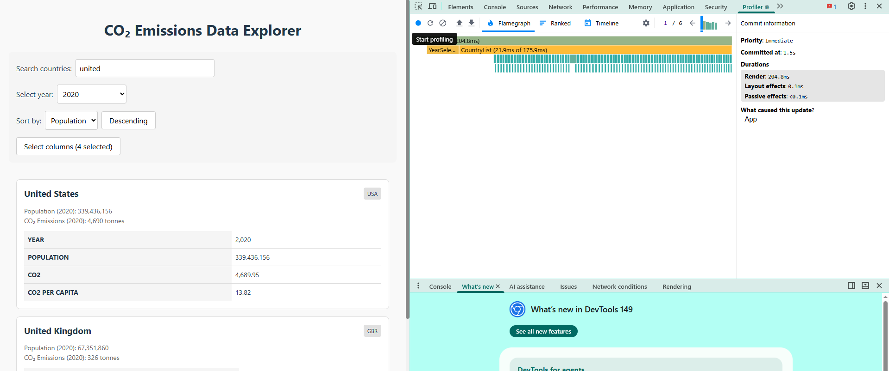
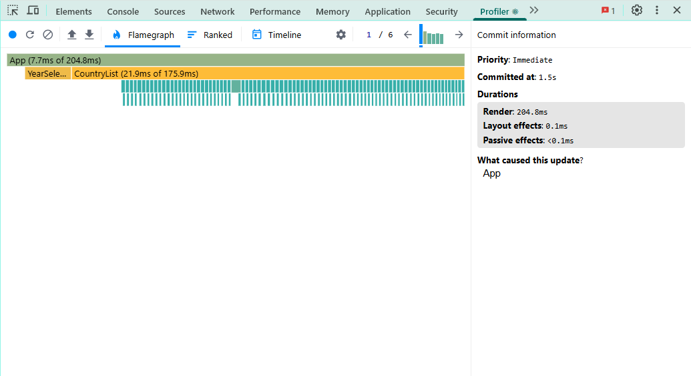

---

### Interaction C: Change year

- **Commit duration**: 509.5 ms
- **Render duration**: 509.4 ms
- **Screenshot**: 
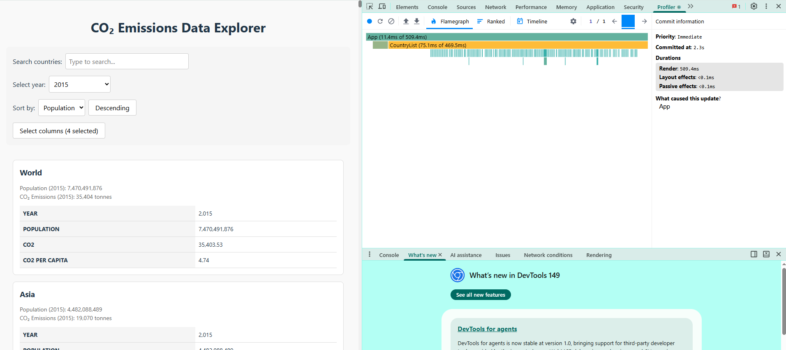
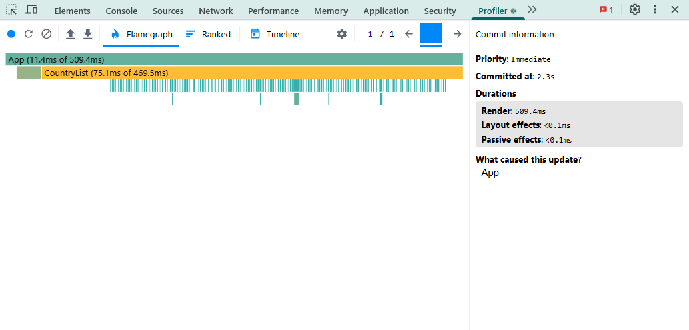

---

### Interaction D: Toggle column

- **Commit duration**: 546.5 ms
- **Render duration**: 546.4 ms
- **Screenshot**: 
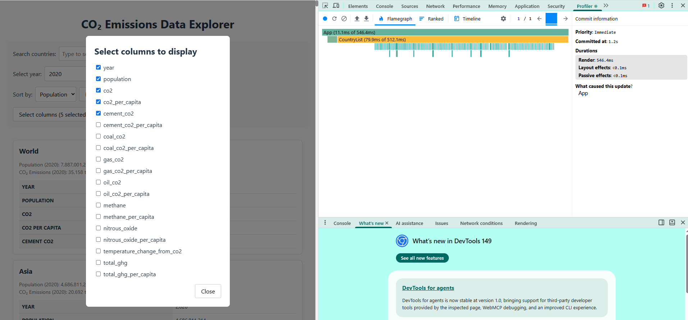
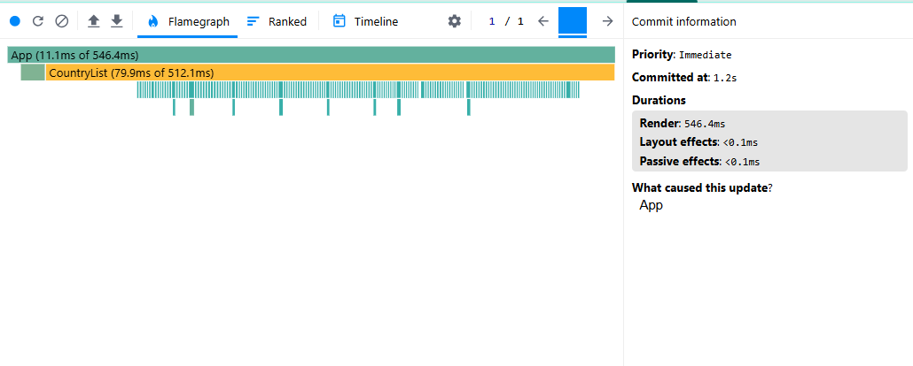

## Optimized Measurements

### Interaction A: Sort countries

- **Commit duration**: 51.2 ms
- **Render duration**: 51.1 ms
- **Screenshot**:
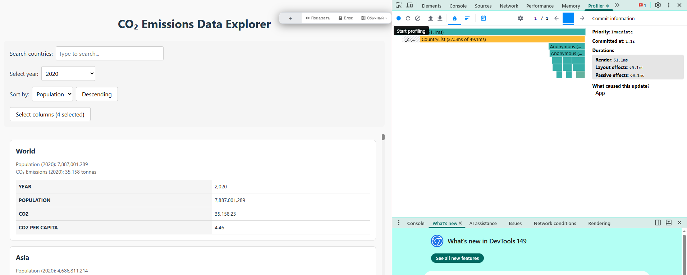

### Interaction B: Search countries

- **Commit duration**: 24.9 ms
- **Render duration**: 24.8 ms
- **Screenshot**:
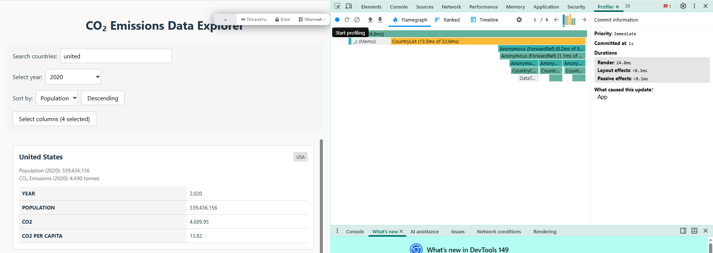
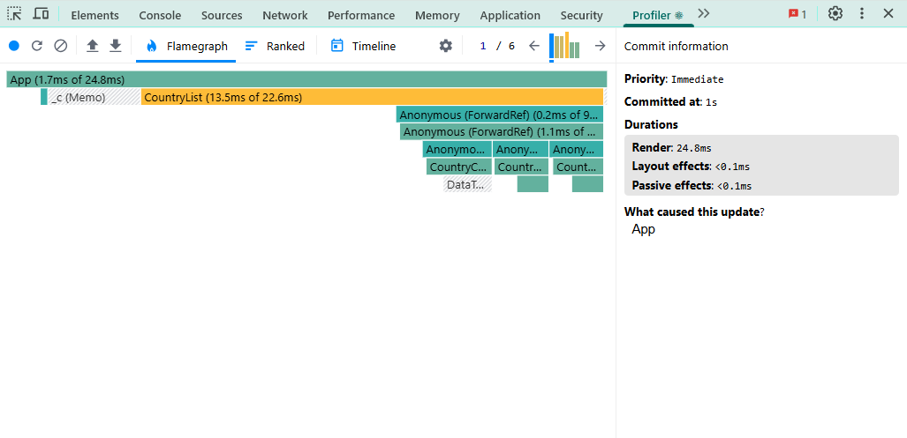

### Interaction C: Change year

- **Commit duration**: 66.6 ms
- **Render duration**: 66.5 ms
- **Screenshot**:
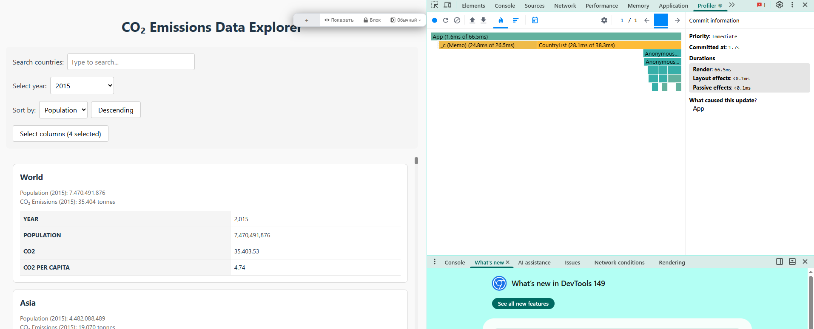
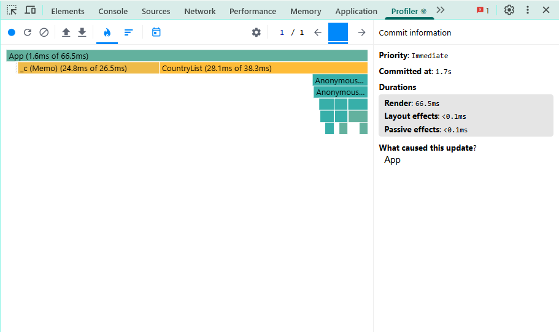

### Interaction D: Toggle column

- **Commit duration**: 51.3 ms
- **Render duration**: 51.2 ms
- **Screenshot**: 
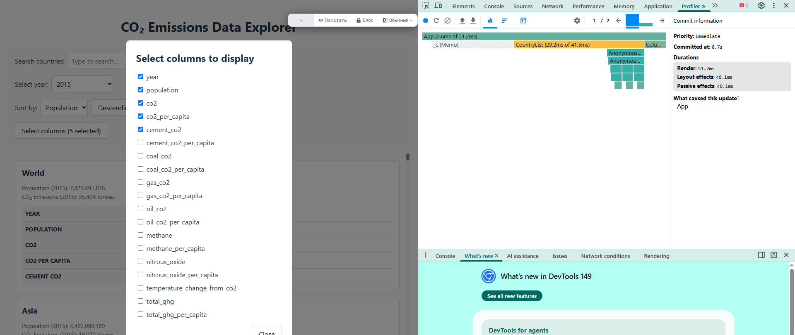
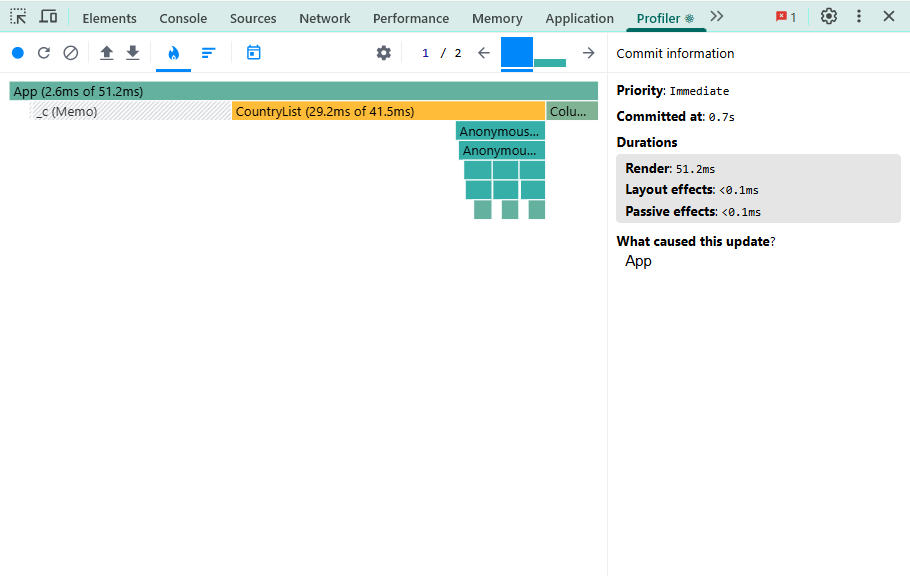

## Summary of Improvements

| Interaction      | Baseline (ms) | Optimized (ms) | Improvement |
| ---------------- | ------------- | -------------- | ----------- |
| Sort countries   | 549.4 ms      | 51.2 ms        | 90.68%      |
| Search countries | 204.9 ms      | 24.9 ms        | 87.84%      |
| Change year      | 509.5 ms      | 66.6 ms        | 86.92%      |
| Toggle column    | 546.5 ms      | 51.3 ms        | 90.61%      |
| **Average**      | **452.6 ms**  | **48.5 ms**    | **89.28%**  |